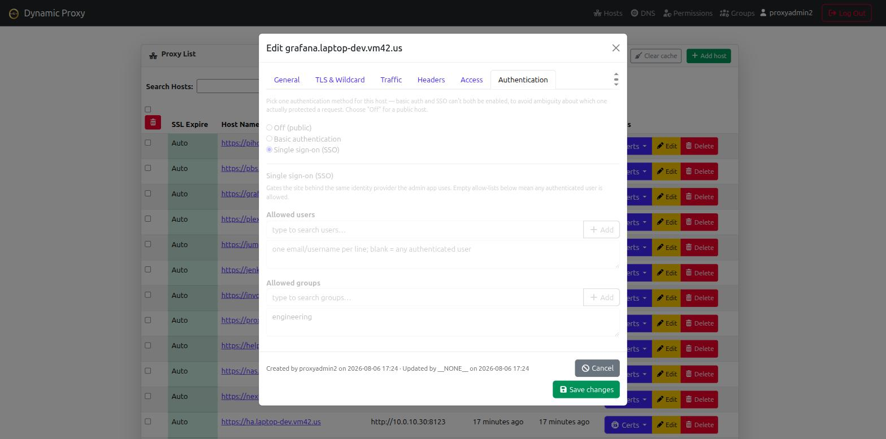
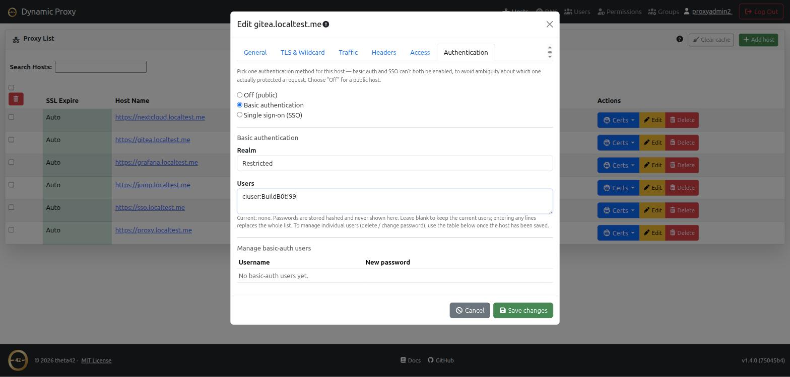

# Theta Proxy

A reverse proxy and HTTPS termination service built on OpenResty/nginx, with a
management API and web GUI. It puts any of your apps behind single sign-on (OIDC)
and can also look users up directly in LDAP — so the same people who log in to
[Theta Directory](https://github.com/theta42/theta-directory) are the people
allowed to reach your proxied apps.

It handles the parts that are tedious to do by hand: automatic HTTPS certificates
from Let's Encrypt (including wildcards via DNS-01), routing by hostname with
wildcard matching, and per-host access control tied to your identity provider.
You manage hosts, DNS providers, and permissions from a web UI or a REST API; the
proxy serves them over TLS with auto-renewing certs and no downtime on changes.

Theta Proxy is deployed as part of [Theta Suite](https://github.com/theta42/theta-suite),
alongside Theta Directory (bundled OpenLDAP + OIDC) and Theta Gateway — it
isn't installed or run on its own. `./setup.sh` generates the OIDC + LDAP
wiring from a single `setup.env` so the proxy and the SSO find each other
without manual config.

**Documentation:** [https://theta42.github.io/theta-suite/proxy/](https://theta42.github.io/theta-suite/proxy/)
([CHANGELOG.md](CHANGELOG.md) for what changed in each release) — also
readable from the running app itself at `/docs`, no internet access required.

## Screenshots

| Hosts | Authentication |
| --- | --- |
| [](docs/images/hosts.png) | [](docs/images/host-auth-sso.png) |

Basic auth and SSO are mutually exclusive per host, with per-user password
management once basic auth is enabled:

[](docs/images/host-auth-basic.png)

Multiple backend targets per host, load balanced round-robin:

[](docs/images/load-balancing.png)

## Features

- Automated HTTPS/SSL certificate management via Let's Encrypt
- Support for HTTP-01 (auto-ssl) and DNS-01 (wildcard) ACME challenges
- Multiple DNS provider integrations (Cloudflare, DigitalOcean, PorkBun, DuckDNS — DuckDNS is free)
- Wildcard SSL certificate support with automatic renewal
- Dynamic host routing with wildcard domain matching (*, **)
- **Multi-target load balancing** — configure multiple backend targets per host with built-in round-robin load balancing
- Web-based management interface
- RESTful API for automation
- **OIDC login** — the proxy is an OpenID Connect client of
  [Theta Directory](https://github.com/theta42/theta-directory)
- **Direct LDAP lookups**, independent of the OIDC flow
- **Role-based access control (RBAC)** — global admins, local groups, and
  per-domain permissions (viewer/manager) via `/api/permission` and `/api/group`
- Self-service API tokens (PATs) for scripting/CI without a browser session
- Unix socket-based host lookup for high-performance routing

## Requirements

- Docker + Docker Compose (everything else — Node.js, OpenResty, Redis — runs
  inside the container Theta Suite builds)
- Inbound internet access for Let's Encrypt validation

## Deployment

Theta Proxy is deployed exclusively via Docker Compose as an integrated service within **Theta Suite**:

```bash
git clone --recursive https://github.com/theta42/theta-suite.git
cd theta-suite
cp setup.env.example setup.env   # set CFG_DOMAIN to your domain
./setup.sh                       # generates config, builds, and starts Theta Suite
```

All routing rules, OIDC client secrets, and LDAP settings are automatically wired during `./setup.sh` bring-up.

See the main [Theta Suite README](https://github.com/theta42/theta-suite) for full details on setup, domain configuration, TLS certificates, and backup management.

## DNS Provider Configuration

For wildcard SSL certificates, configure a DNS provider via the web UI or API:

**Supported providers:**
- **Cloudflare** - Requires API token
- **DigitalOcean** - Requires API token
- **PorkBun** - Requires API key and secret API key
- **DuckDNS** - Free. Requires your account token and the list of subdomains
  you've registered at [duckdns.org](https://www.duckdns.org) (e.g.
  `myhost` for `myhost.duckdns.org`). Good option if you don't own a
  domain — DuckDNS gives you one for free. Note DuckDNS only supports a
  single A/AAAA record and a single TXT record per domain (no arbitrary
  subdomains), which is enough for both dynamic DNS and DNS-01 wildcard
  certs but not for hosting other DNS records.

Once configured, create a wildcard host (e.g., `*.example.com`) and the system will automatically request and manage the DNS-01 challenge certificate.

## Architecture

The system consists of three main components:

1. **OpenResty/Nginx** - Frontend proxy with Lua-based routing
   - Handles SSL termination via lua-resty-auto-ssl
   - Queries Node.js backend via Unix socket for host routing
   - Proxies requests to configured backend servers

2. **Node.js API** - Backend management and control plane
   - RESTful API for host/user/DNS management
   - Wildcard SSL certificate orchestration
   - Host lookup tree with wildcard matching
   - User authentication and authorization

3. **Redis** - Data store (using [model-redis](https://www.npmjs.com/package/model-redis) ORM)
   - Host configurations
   - User accounts and tokens
   - SSL certificate storage
   - Domain and DNS provider configurations

## Host Lookup System

The proxy supports sophisticated domain matching:
- **Exact match**: `example.com` matches only `example.com`
- **Single wildcard**: `*.example.com` matches `sub.example.com` but not `deep.sub.example.com`
- **Double wildcard**: `**.example.com` matches any depth (`sub.example.com`, `deep.sub.example.com`, etc.)
- **Mixed wildcards**: `api.*.example.com` matches `api.v1.example.com`, `api.v2.example.com`, etc.

Priority: Exact match > Single wildcard > Double wildcard

## API Documentation

See [API Documentation](nodejs/api.md) for complete API reference.

## Contributing

Pull requests are welcome. The project uses GitHub Actions for CI/CD:
- Tests run automatically on all PRs
- All tests must pass before merging to master
- Tests run on Node.js 18.x, 20.x, and 22.x

## License

MIT - See LICENSE file for details.

## Project Structure

```
proxy/
├── nodejs/              # Node.js backend application
│   ├── bin/            # Entry point (www)
│   ├── conf/           # Configuration (base.js, environment overlays, secrets.js)
│   ├── controller/      # App-level wiring (pubsub, startup)
│   ├── migrations/      # One-off Redis data migration scripts
│   ├── models/         # Data models (Host, User, DNS providers)
│   ├── routes/         # API routes
│   ├── services/       # Background services (host lookup, scheduler)
│   ├── middleware/     # Express middleware
│   ├── utils/          # Utility functions
│   ├── public/         # Static web assets
│   ├── views/          # EJS templates
│   └── test/           # Test suite
├── ops/                # Operations and deployment
│   ├── nginx_conf/     # OpenResty configuration files
│   ├── install.sh      # Automated installer
│   └── proxy.service   # Systemd service definition
└── .github/workflows/  # CI/CD workflows
```
