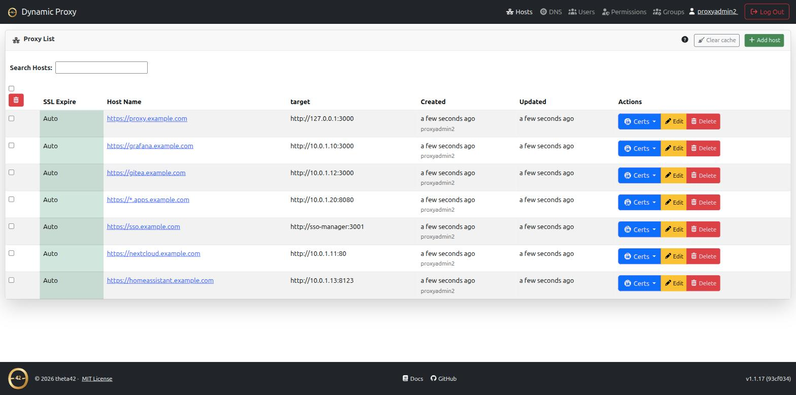
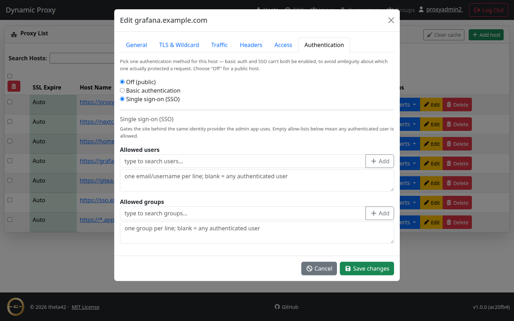
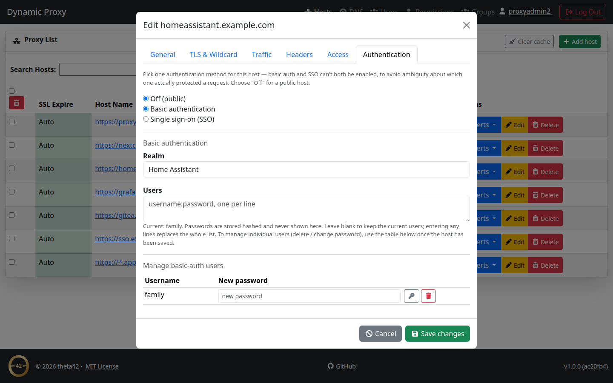

# Proxy

A reverse proxy and HTTPS termination service built on OpenResty/nginx, with a
management API and web GUI. It puts any of your apps behind single sign-on
(OIDC) and can also look users up directly in LDAP — so the same people who
log in to your SSO are the people allowed to reach your proxied apps.

Automatic HTTPS from Let's Encrypt (including wildcards), routing by hostname,
and per-host access control tied to your identity provider — managed from a
web UI or a REST API, with no downtime on config changes.

Part of the theta42 self-hosted identity stack, alongside
[SSO Manager](https://theta42.github.io/sso-manager-node/) and
[theta-env](https://theta42.github.io/theta-env/) (the two composed with one
command).

## Screenshots

<a href="images/hosts.png" target="_blank"></a>
<a href="images/host-auth-sso.png" target="_blank"></a>

Basic auth and SSO are mutually exclusive per host, with per-user password
management once basic auth is enabled:

<a href="images/host-auth-basic.png" target="_blank"></a>

*(click any screenshot to view full size)*

## Why this over the alternatives

Nginx Proxy Manager, Traefik, and Caddy are all good reverse proxies with
auto-HTTPS. This one is built around identity: it is both an **OIDC client**
of an SSO provider (for browser login) **and** a direct **LDAP client** (for
user lookups and per-host access control), so access decisions come from your
real user directory, not a static allow-list or a separate auth proxy bolted
on top. The trade-off is that it expects an OIDC/LDAP identity source to point
at — it is not a standalone auth server. Pair it with
[SSO Manager](https://theta42.github.io/sso-manager-node/) (bundled OpenLDAP +
OIDC) for a self-hosted SSO + proxy stack, or point it at any OIDC provider +
LDAP directory you already run.

## Features

- Automated HTTPS via Let's Encrypt — HTTP-01 and DNS-01 (wildcard) challenges
- Multiple DNS providers (Cloudflare, DigitalOcean, PorkBun, DuckDNS — free)
- Dynamic host routing with wildcard domain matching (`*`, `**`)
- **OIDC login** and **direct LDAP lookups**, independently of each other
- Per-host **basic auth** as an alternative to SSO (mutually exclusive, so
  it's never ambiguous which one gated a request)
- **Role-based access control** — global admins, local groups, and
  per-domain permissions (viewer/manager)
- Self-service API tokens for scripting/CI without a browser session
- Web UI and a full REST API

## Get it

```bash
git clone https://github.com/theta42/proxy.git
cd proxy && docker compose up -d --build
```

That's the standalone quick start. For the full set of install options (Docker,
bare-metal, or as part of the combined SSO + proxy stack), configuration
reference, and API docs, see the
**[GitHub repository](https://github.com/theta42/proxy)**.

## Related projects

- **[SSO Manager](https://theta42.github.io/sso-manager-node/)** — the OIDC
  provider + LDAP directory this proxy is designed to sit in front of.
- **[theta-env](https://theta42.github.io/theta-env/)** — runs this proxy and
  SSO Manager together with one command.
